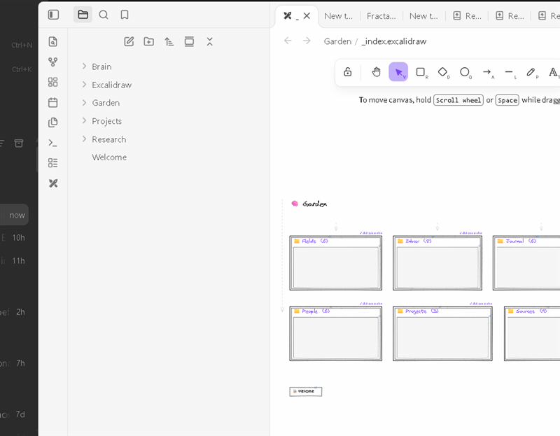

# 🧠 obsidbrain

**Fractal knowledge maps for [Obsidian](https://obsidian.md), powered by the [Excalidraw plugin](https://github.com/zsviczian/obsidian-excalidraw-plugin).**

Turn any folder into a stable, zoomable, infinitely-nestable visual map — with positions that never move out from under you, and arrows that come from your *actual* wikilinks.



> Every image in this README is rendered from a real generated map. See the full [Gallery](docs/GALLERY.md).

## Why

| Tool | The problem | obsidbrain's answer |
|---|---|---|
| Graph views | nodes float on springs — the map you memorized is gone on every navigation | **positions are permanent** — your spatial memory compounds |
| Folder trees | structure is invisible; you scroll, you don't *see* | every folder becomes a **map**: files as cards, subfolders as pods with live embeds |
| Hand-drawn diagrams | arrows drift, layouts rot, maintenance kills them | maps are **generated** from your notes — zero maintenance, regenerate any time |

## The three scripts

| Script | What it does |
|---|---|
| **Fractal Index** | Generates a folder's map: file cards, subfolder pods with live embeds of their own maps, breadcrumbs, and relationship-aware arrows |
| **Fractal Sync** | One command regenerates the *entire* brain — every level, prompts once. This is your weekly review |
| **Fractal Navigate** | Startup script: click a pod to *dive* into its embedded map, click again to surface, drag cards and arrows follow live |

## Install

### From this repo (recommended)

Open the Excalidraw Script Store in Obsidian (Excalidraw settings → Scripts → Script store), or download the scripts directly into your vault's script folder:

- [scripts/Fractal Index.md](scripts/Fractal%20Index.md)
- [scripts/Fractal Sync.md](scripts/Fractal%20Sync.md)
- [scripts/Fractal Navigate.md](scripts/Fractal%20Navigate.md)

Then in Obsidian: **Settings → Excalidraw → Scripts → Startup script** → `Excalidraw/Scripts/Fractal Navigate.md` (makes dive/arrow-tracking active in every drawing).

### Try it with a demo brain first

```bash
git clone https://github.com/ActArtech/obsidbrain.git
cd obsidbrain
node examples/install-demo.mjs knowledge-garden "<path-to-your-vault>"
```

That installs a 51-note showcase brain with deliberate link topology — the READMEs *predict* which arrows you'll see, so you can verify everything works.

## Rebuild maps without opening Obsidian

```bash
node scripts/build-index.mjs "<path-to-vault>"   # regenerates every _index map on disk
```

## The 5-minute start

1. In any folder, create an Excalidraw drawing named `_index`
2. Open it → Excalidraw Scripts panel → **Fractal Index** → *"folder + create sub-indexes"* → *"with note-link arrows"* → pick a direction (**TD** = hierarchy, **LR** = journey)
3. **Click a pod**: the canvas dives into that subfolder's own map. Click again: surface
4. Weekly: open the root map and run **Fractal Sync** — every level regenerates in one command. Nothing you arranged by hand ever moves

## What makes it different

### Positions you can trust

Every node's position comes from a persistent slot identity. Regeneration **adopts** your manual arrangement instead of snapping back to a grid. Renamed folders keep their positions. New files append; deleted files vanish. The [Fractal Index tests](fractal-index/test/run-tests.mjs) cover rename, move, delete, add, and reorder churn.

### Relationship-aware curved arrows

Arrows come from your notes' **actual wikilinks** (`metadataCache.resolvedLinks`) — never hand-drawn, never stale. Five relationship types are inferred from topology, each with its own visual signature:

| Type | Meaning | Look |
|---|---|---|
| **resonates** | mutual link (A→B *and* B→A) | thick solid purple, double-headed, Bezier curve |
| **peer** | same-folder link | solid purple, single arrow |
| **bridges** | pod↔pod cross-folder dependency | dashed blue |
| **nourishes** | pod→card | dotted muted purple |
| **feeds** | card→pod | thin dotted light purple |

Structural edges (spine, stubs) use orthogonal routing; relationship edges use Bezier curves — shape carries meaning.

### Four projections of one hierarchy (bonus: dual-views)

For outcome-driven work management, the [`dual-views/`](dual-views/) CLI turns one GitHub-backed work hierarchy into four synchronized views: **treemap** (where is the mass?), **story map** (does the journey hold?), **timeline** (how far along?), and **workmap** (fractal drill-downs). CI-friendly, zero dependencies:

```bash
node dual-views/cli.mjs --source gh:owner/repo --out views
```

### Agent-callable (bonus: MCP)

[`mcp/`](mcp/README.md) ships a zero-dependency [Model Context Protocol](https://modelcontextprotocol.io) server so AI agents can generate maps, sync brains, query link graphs, and drive dives as tool calls.

## Documentation

- [Full guide](docs/GUIDE.md) — philosophy, quick start, feature reference, FAQ
- [The workflow](docs/WORKFLOW.md) — the daily/weekly operating loop
- [Use-case recipes](docs/USE-CASES.md) — 5 personas with folder shapes and link etiquette
- [Gallery](docs/GALLERY.md) — rendered maps with captions
- [Review and fixes](docs/REVIEW-AND-FIXES-2026-10-07.md) — changes, verification, and upstream PR handoff
- [Examples](examples/README.md) — three installable brains, small → showcase scale

## Requirements

- Obsidian ≥ 1.8.7 with the [Excalidraw plugin](https://github.com/zsviczian/obsidian-excalidraw-plugin) ≥ 2.0.0 (developed against 2.28.1)
- `dual-views` / `mcp`: Node ≥ 20

## Status & roadmap

Automated suites define **104 checks** across Fractal Index (54), dual-views (46), and MCP (4). The original scripts were live-verified on Obsidian 1.14.4 + Excalidraw 2.28.1; see the [latest verification report](docs/REVIEW-AND-FIXES-2026-10-07.md) for the current changes.

Roadmap: ELK-layered first-run layout (code in place; activates when the CDN is reachable from Obsidian's renderer), coverage/age lens for dual-views.

## License

[MIT](LICENSE) © 2026 obsidbrain contributors
