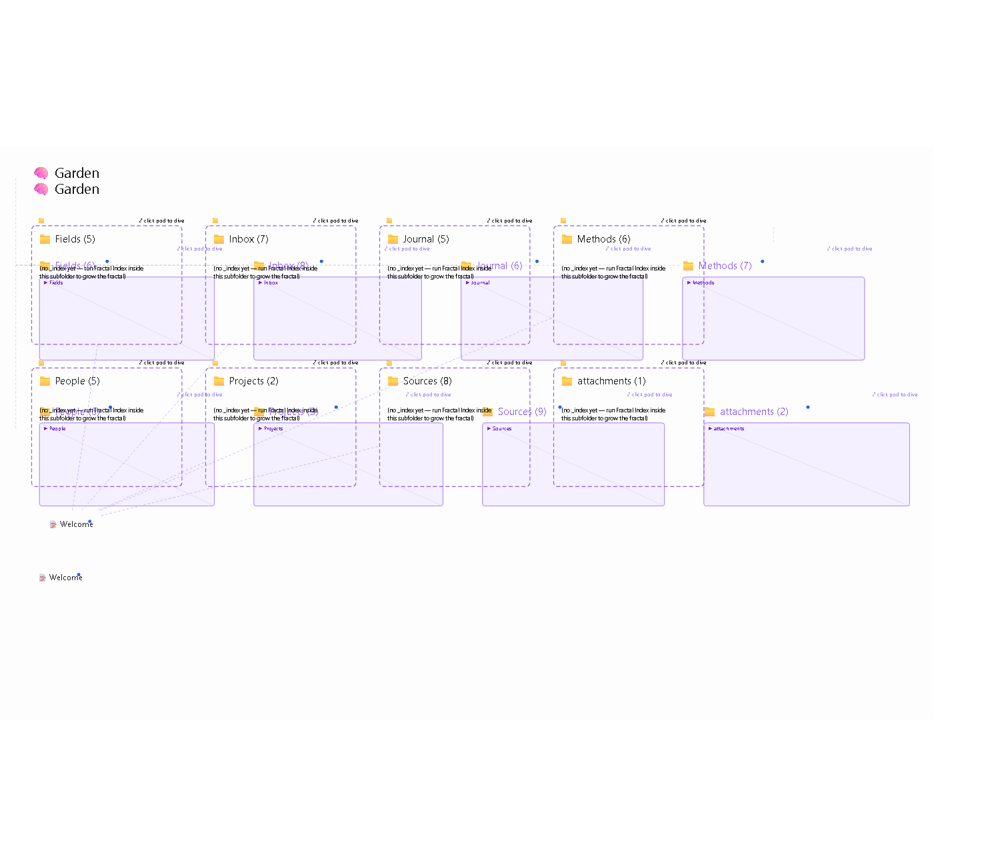
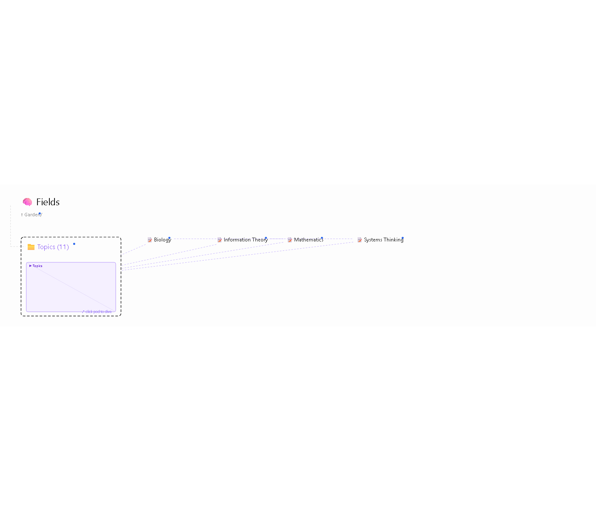
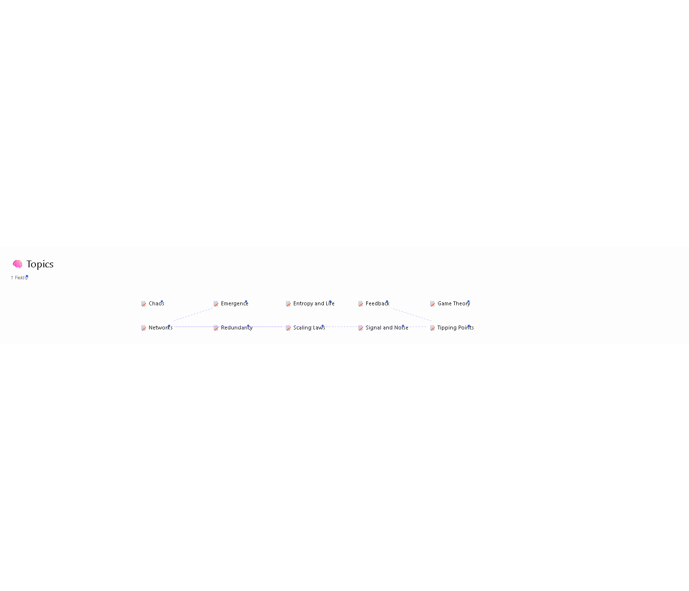
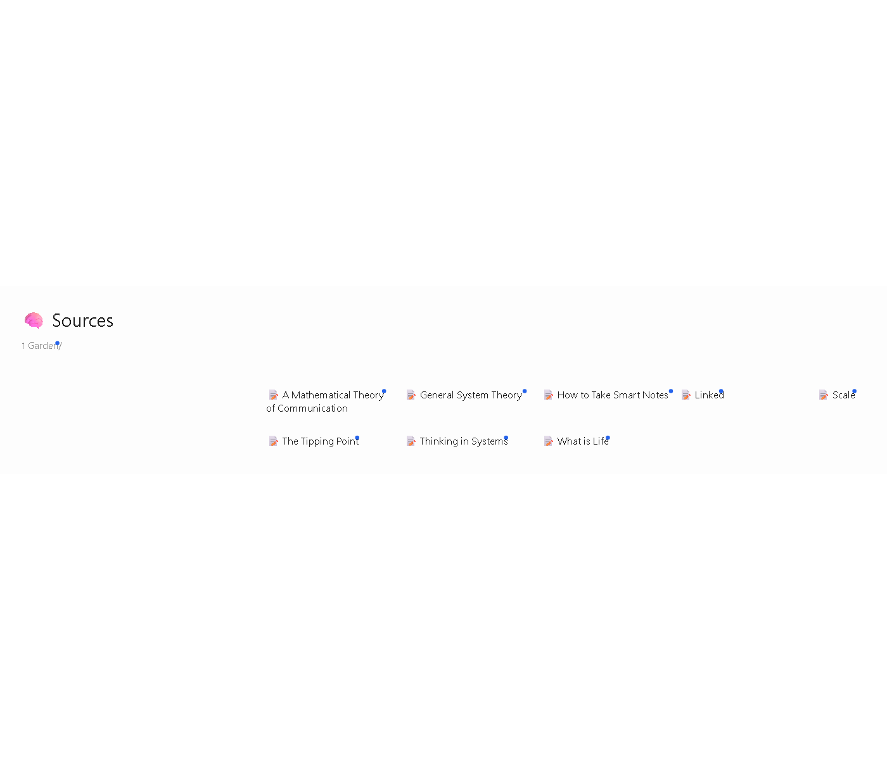
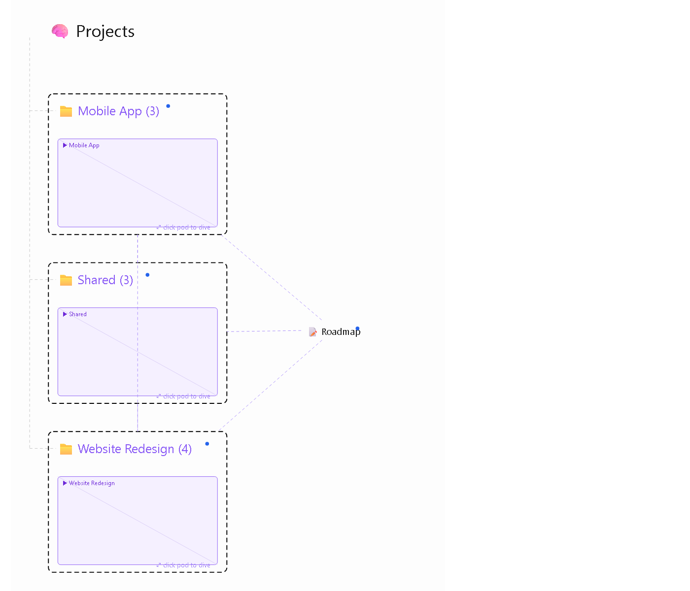
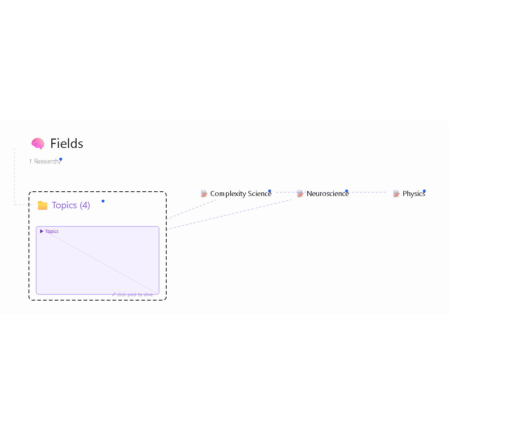
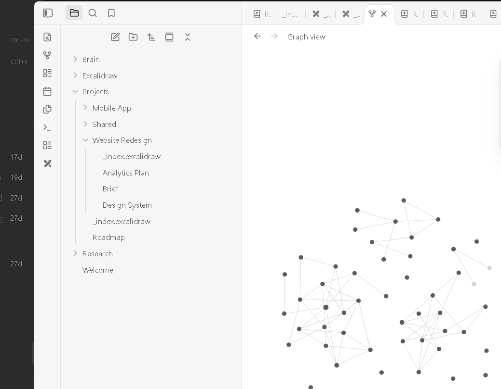
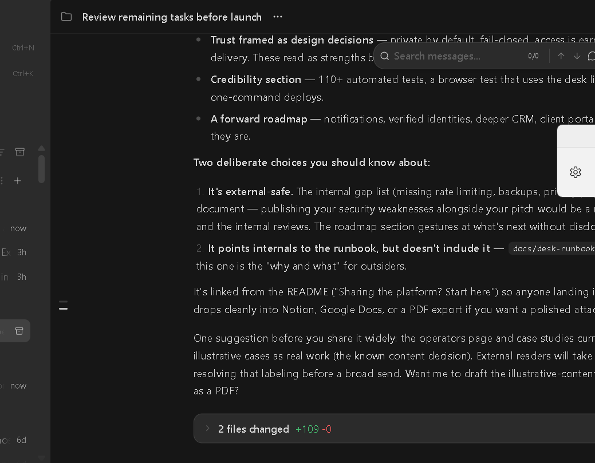

# Gallery

Every image below is rendered from a **real generated map** (or a real
Obsidian screenshot) — no mockups. Reproduce any of them by installing the
named example and running Fractal Index.

---

## Knowledge Garden — at scale

### The map of maps (root, 8 pods, 21 arrows)

51 notes seen from orbit: the Welcome hub card on the left of the file grid,
nine pods down the spine, and 21 purple arrows — 5 of them double-headed
mutuals — including the Sources ⇄ Fields citation web and the Journal pod's
fan-out. The strongest 60 of ~100 relationships, readable at a glance.

### Fields — the literature pattern

Four field cards plus the Topics pod. All 6 arrows here are **mutual**
(double-headed): fields and their sub-topics reference each other both ways,
and the Topics pod exchanges edges with the field cards — the Zettelkasten
pattern drawn by your own links.

### Topics — hub visibility

Ten atomic topic notes. Emergence (three arrows out) and Networks are the
load-bearing ideas — you can see the hub before you read a word.

### Sources — calm by design

Eight literature notes, zero arrows *at this level* — every link points to
other folders, so they appear one level up as pod edges. This honesty is the
anti-hairball rule: arrows live where both endpoints live.

---

## Project Hub — cross-project dependencies

The portfolio map: Roadmap card plus three pods, six dependency arrows
including the cross-project edges (Mobile App → Shared, Mobile App →
Website Redesign). No todo tool shows you this.

---

## Research Brain — mutual pairs

Neuroscience ⇄ Complexity Science as one double-headed arrow, Physics ⇄
Complexity Science, and two arrows rising from the Topics pod to field
cards — children pointing at their parents.

---

## Live in Obsidian

### The dive

A real Obsidian window after clicking the Mobile App pod: the canvas has
dived ~3.3× into that pod's embedded sub-map (click again to surface).
Framed by the actual app chrome — this is the plugin, not a mockup.

### The whole brain, really running

The Project Hub map open in Obsidian 1.14.4 with the Excalidraw plugin's
native rendering — pods, embeds, dive chips, and link arrows as saved by
the plugin itself.
